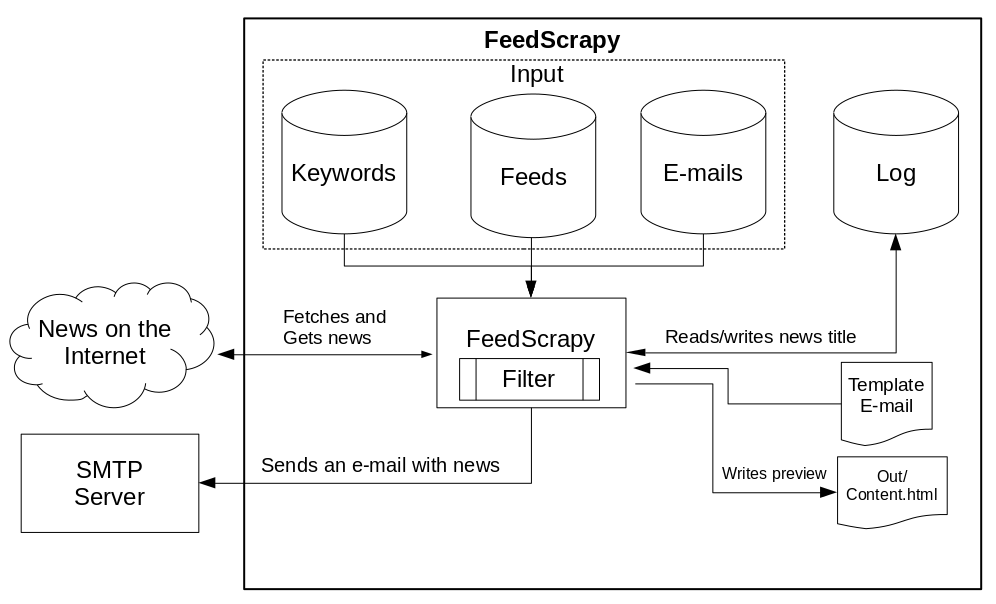

**FeedScrapy Bot** is a bot to notify people about specific news. This bot listens a list of RSS and fetch for specific keywords, than, it send an e-mail to a list of e-mails with the related news as content.

# How to Install
* Install Python 3
* `pip install -r requirements.txt`
* `git clone https://github.com/Cledersonbc/feedscrapy.git`

# How to Config
Two configuration files are available: *app_config.json* and *config_server.json*.

## App Config
App config contains the configurations about the app. Your extension is *.json* because it's simple to be manipulated by the Python programs, if compared with *.xml* files.

* **maxfeed**: max number of news per RSS. By default it is 5.
* **clock**: time (in minutes) that this bot visit a list of RSS. By default it is 15 minutes.
* **template_name**: the model of the message to be sent to a list of e-mails. You may create your own template using HTML, then put it in templates folder. Don't forget to put {{entries}} tag in your template, it's where the content will be placed. By default it's *basic.html*.
* **type_search**: for a while, two types are available:
  * 0: fetches for some keyword in title or summary (default).
  * 1: fetches for all keyword in title or summary.
* **maxlog_length**: the length (in MB) of the log file. By default it's 500 MB.

## Server Config
You need to provide some informations for this bot to work.

* **server**: a SMTP server like smtp.gmail.com, for example.
* **port**: a port of this server, like 25 or 587.
* **user**: your e-mail, e.g. my_email@validEmail.com.example.
* **password**: password of your e-mail.

Note: use your user and pass according to your SMTP server

## Input Config
In the input folder you need to provide a list of e-mails, keywords and RSS feeds.
* **e-mails**: put any e-mails. Each news will be sent to these e-mails. One e-mail per line.
* **feeds**: put any RSS feeds like <http://g1.globo.com/dynamo/brasil/rss2.xml>. One e-mail per line.
* **keywords**: here are the magic. You need to specify some keywords and the bot will fetch news with these keywords in your RSS feeds, than, it send to a list of e-mails.

# General Structure

	

FeedScrapy reads a specific keywords from input. So, it reads RSS feeds and a list of e-mails too from input. Then, the bot go to the internet to fetch related news.
When it founds a related news, it checks the log file. It's important because we don't need a spam bot sending the same news at all the time. Then, the bot modify the log and formats the e-mail with the news in some template (preview available in out/content.html before the bot send it). The e-mail is sent to a SMTP server and he takes the final job.

# Final Considerations
This bot was created to help my brazilians friends to be notified about [truckers’ strike](https://www.washingtonpost.com/world/the_americas/in-brazil-a-truckers-strike-brings-latin-americas-largest-economy-to-a-halt/2018/05/25/fe3f06e6-6026-11e8-b656-236c6214ef01_story.html) and related urgent news. For this reason, messages of the bot are in Portuguese.

This bot was written in Python. Why Python? Answer [pt-br]: *"Por que foi escrito em Python? Porque é como escrever um poema de Paulo Leminski."*
